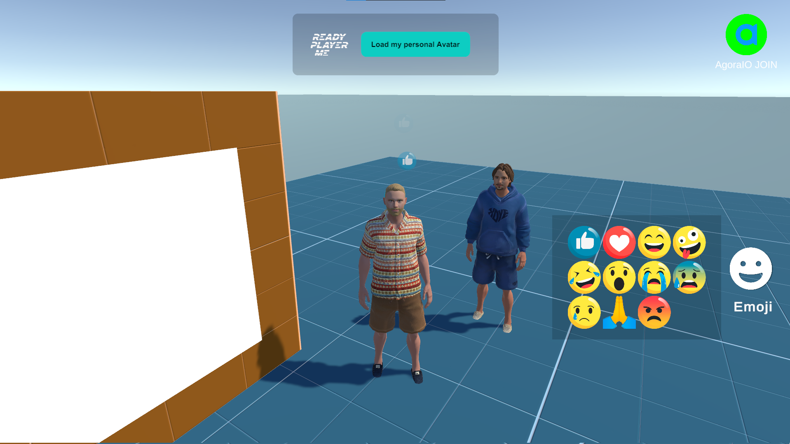

# Multiplayer Fusion with AgoraIO
Voice, Video Call, ScreenShare, Emoji Reactions, Ready Player me.

## Features
- Multiplayer with Photon Fusion and KCC

- Emoji reactions

- Video call
- List webcams

- Voice Call
- Enable/Disable Mic

- ScreenShare Desktop

- Avatar Load Ready Player me
- Copy and Paste url link and click button 'Load my Avatar'
- Random avatar load, click button key F1 or F2

support Windows
Build Link -> https://drive.usercontent.google.com/download?id=1_9IIEZ8jJrUV8K-VlW9k_SB-CHWt6GyH&export=download